# 智慧騎行 · 追逐模式

以遊戲化方式進行室內騎行功率訓練。維持目標功率，甩開後方追逐者；功率不足時距離縮短，緊張感隨之升高。路線含**平路／上坡／下坡**，並支援 **12 種追逐者主題**（角色 Sprite Sheet + 專屬夜間場景）。

**平台：** Electron 桌面應用（Raspberry Pi 5 ARM64 / Windows x64）  
**版本：** 1.3.0

---

## 遊戲畫面

### 主選單

星空與遠山背景，可直接以模擬模式開始，或先連接 BLE 騎行台。

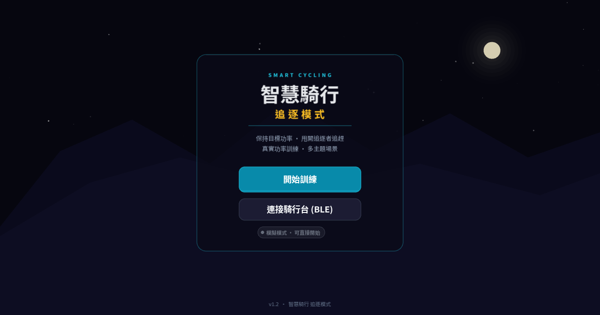

### 訓練計畫與主題選擇

內建六套分段功率計畫；上方 chip 可切換全部追逐者主題。

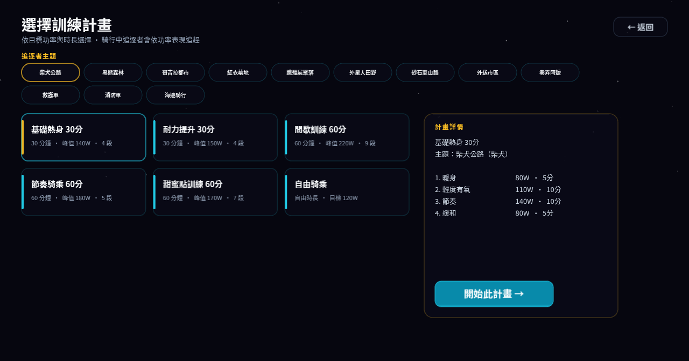

### 主題一覽（追逐場景）

#### 柴犬公路 · shiba

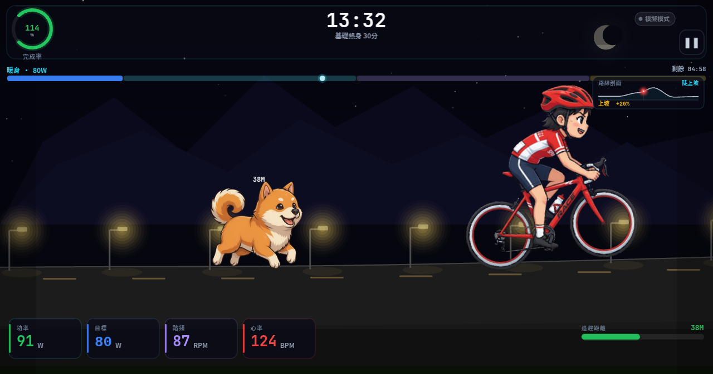

#### 黑熊森林 · bear

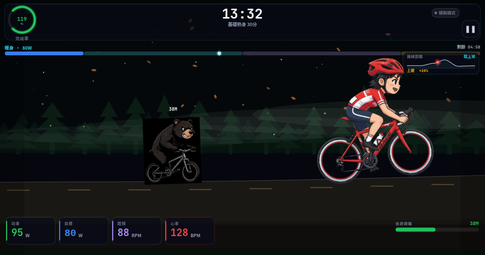

#### 哥吉拉都市 · godzilla

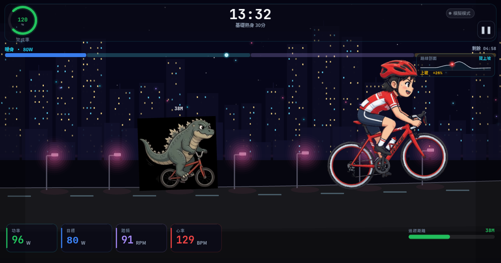

#### 紅衣墓地 · redlady

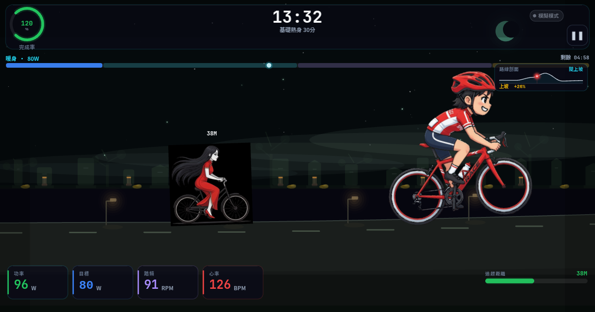

#### 跳殭屍聚落 · jiangshi

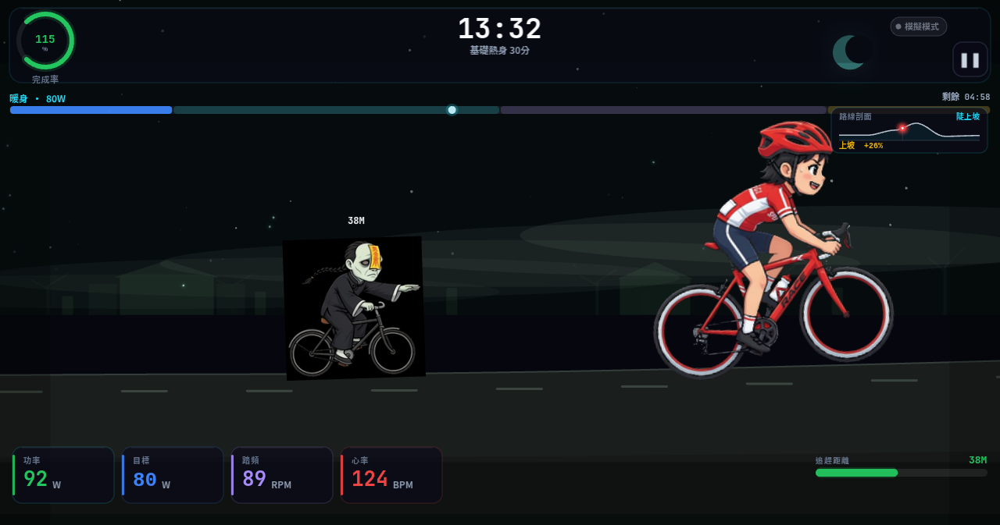

#### 外星人田野 · alien

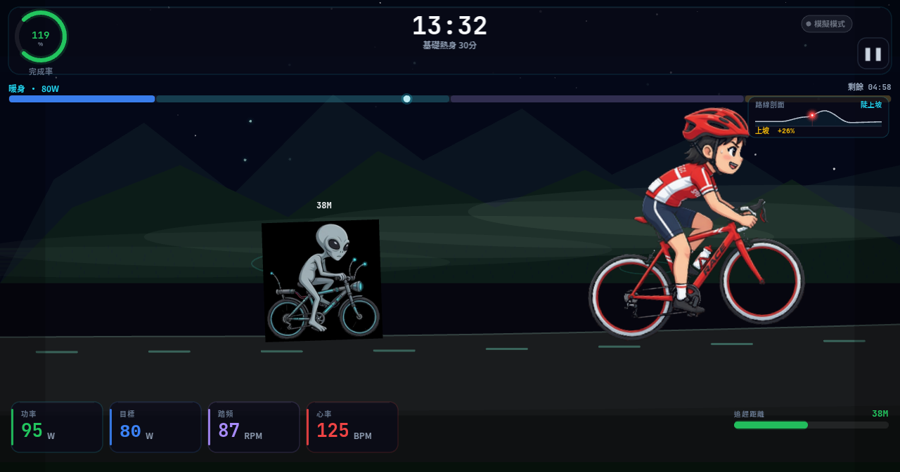

#### 砂石車山路 · dumptruck

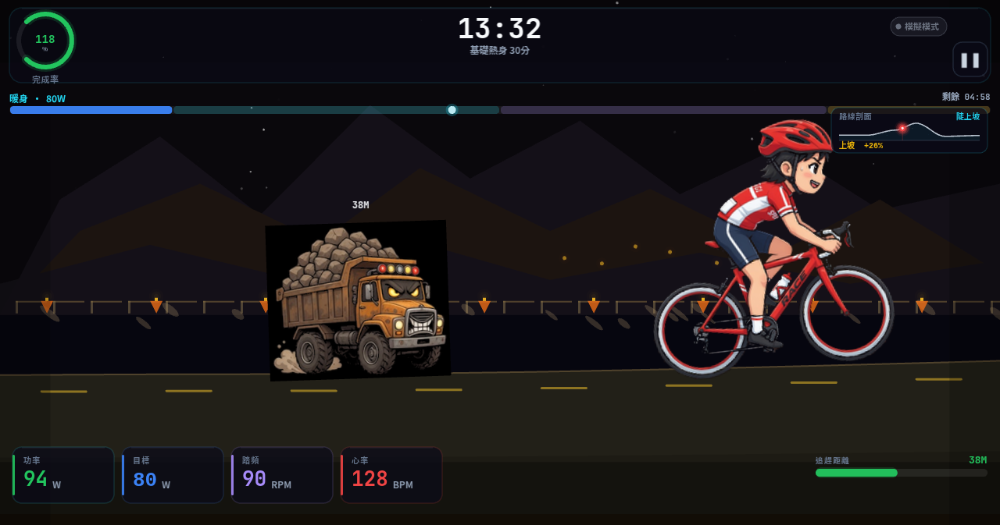

#### 外送市區 · foodpanda

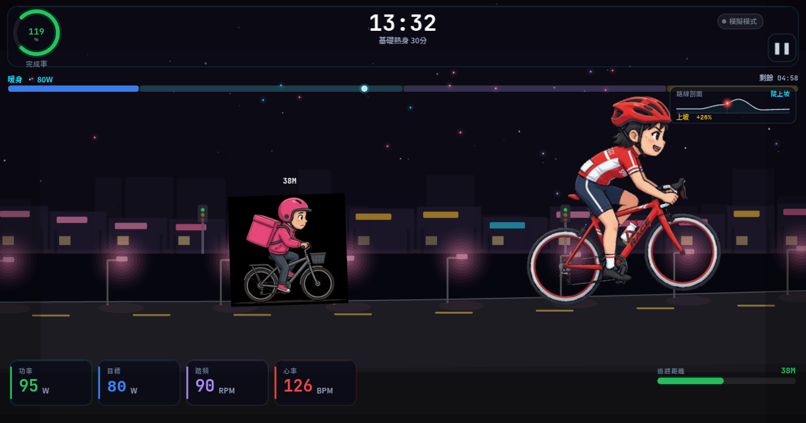

#### 巷弄阿嬤 · grandma

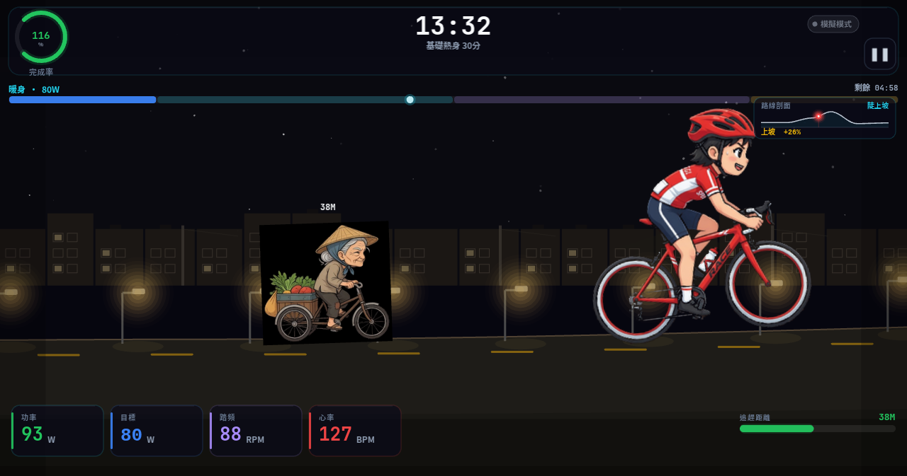

#### 救護車 · ambulance

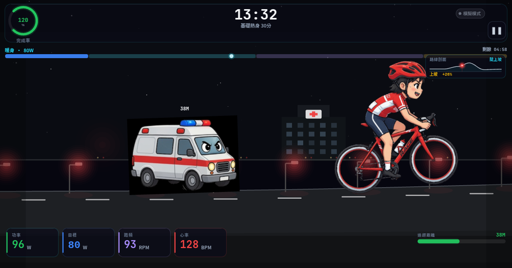

#### 消防車 · firetruck

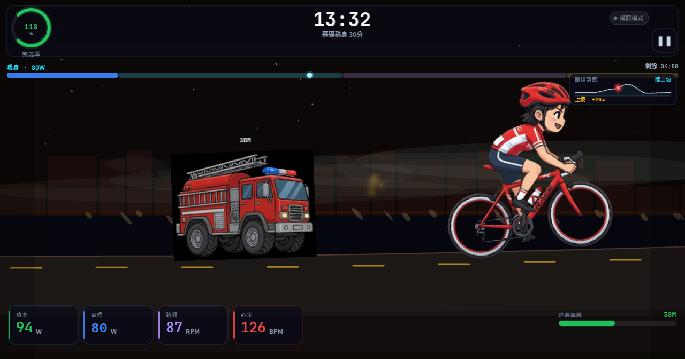

#### 海邊騎行 · bikini

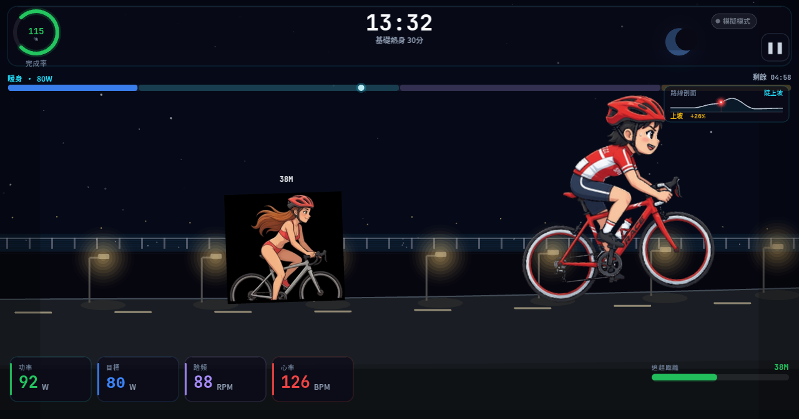

### 下坡路段

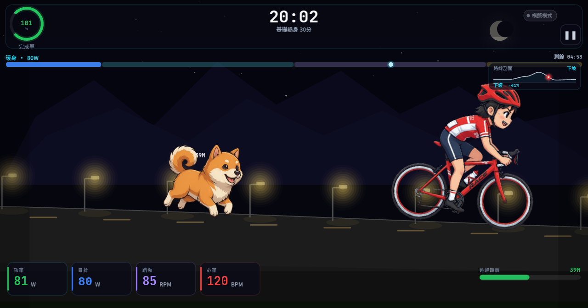

### 角色素材

| 騎士 | 柴犬 |
|:---:|:---:|
| 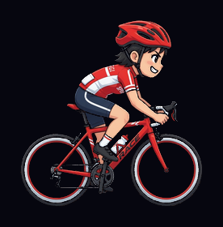 |  |

追逐者 sheet 見 `assets/`（`dog.png`、`bear.png`、`godzilla.png`、`redlady.png`、`jiangshi.png`、`alien.png`、`dumptruck.png`、`foodpanda.png`、`grandma.png`、`ambulance.png`、`firetruck.png`、`bikini.png`）。幀座標：`src/renderer/game/themes.ts`、`assets/chaser-frames.json`。

---

## 遊戲玩法

1. 主選單 **開始訓練**（可選 BLE 連騎行台）
2. 選擇**追逐者主題**與訓練計畫
3. 騎行中：
   - **功率 ≥ 目標** → 拉開距離
   - **功率 < 目標** → 追逐者逼近；過近觸發緊張／危險效果
4. 追逐者會休息後再急速追回
5. 計畫結束顯示結算

### 快捷鍵

| 按鍵 | 功能 |
|------|------|
| `Space` / `P` | 暫停／繼續 |
| `Esc` | 暫停；已暫停時回主選單 |

### 主題切換

| 方式 | 說明 |
|------|------|
| 計畫頁 | 點選「追逐者主題」chip |
| URL | `?theme=firetruck` 或 `?screen=chase&theme=ambulance` |

---

## 追逐者主題一覽

| ID | 追逐者 | 背景 |
|----|--------|------|
| `shiba` | 柴犬 | 夜間公路 |
| `bear` | 黑熊騎單車 | 夜間森林 |
| `godzilla` | 哥吉拉騎單車 | 都市高樓 |
| `redlady` | 紅衣長髮小姐 | 台灣風墓地 |
| `jiangshi` | 跳殭屍 | 廢棄鄉下聚落 |
| `alien` | 外星人 | 夜間田野 |
| `dumptruck` | 砂石車 | 山路／工地 |
| `foodpanda` | 外送員 | 市區騎樓 |
| `grandma` | 三輪車阿嬤 | 傳統巷弄 |
| `ambulance` | 救護車 | 醫院／急診道 |
| `firetruck` | 消防車 | 火災現場感 |
| `bikini` | 比基尼騎手 | 海邊／河岸 |

新增主題：在 `assets/` 放 sheet → 編輯 `themes.ts` → 必要時在 `chase-scene.ts` 加背景繪製。

---

## 主要特色

- **功率驅動追逐** — 距離向功率平衡點平滑收斂（0–80 m）
- **12 種資料驅動主題** — 角色 sheet + 場景旗標 + 行為微調
- **可變坡度 + 路線剖面** — 紅點即時進度
- **6 套訓練計畫** — 含自由騎乘
- **BLE FTMS** — 功率／踏頻；未連線模擬模式
- **跨平台** — `dist:pi` / `dist:win`

---

## 技術架構

| 層級 | 技術 |
|------|------|
| 殼層 | Electron 32 |
| 畫面 | PixiJS 8 + TypeScript |
| 建置 | Vite 6 + tsc |
| BLE | `@abandonware/noble` |
| 打包 | electron-builder |

### 專案結構

```
cycling-chase-game/
├── assets/                 # 騎士／追逐者 sheet、汗珠
├── docs/screenshots/       # README 截圖
├── src/
│   ├── main/               # Electron + BLE
│   └── renderer/
│       ├── game/
│       │   ├── themes.ts        # 主題定義與幀座標
│       │   ├── chase-scene.ts   # 場景、地形、主題背景
│       │   ├── game-state.ts
│       │   └── hud.ts
│       └── scenes/         # 主選單、計畫＋主題
└── package.json
```

---

## 環境與執行

- Node.js 22+、npm 10+ 建議

```bash
npm install
npm run dev
```

僅預覽 renderer：

```bash
npx vite --host 127.0.0.1 --port 5173
```

除錯：`?screen=plan|chase`、`?theme=<id>`

### 建置

```bash
npm run build
npm run dist:pi    # Linux arm64 AppImage
npm run dist:win   # Windows x64
```

---

## 訓練計畫

| 計畫 | 時長 |
|------|------|
| 基礎熱身 30分 | 30 min |
| 耐力提升 30分 | 30 min |
| 間歇訓練 60分 | 60 min |
| 節奏騎乘 60分 | 60 min |
| 甜蜜點訓練 60分 | 60 min |
| 自由騎乘 | 不限 |

距離摘要：0–80 m；達標約 40 m；≤10 m 危險；≤25 m 緊張；狗狀態 `chasing → retreating → resting → returning`。

---

## BLE

- FTMS Indoor Bike `0x1826`
- 主選單連線；斷線回模擬模式

---

## 開發歷程

| 階段 | 版本 | 重點 |
|------|------|------|
| 0–5 | 1.0 | 規格、原型、UI、角色、BLE |
| 6–7 | 1.1 | 追逐手感、坡度與剖面 |
| 8 | 1.2 | 主題系統 shiba／bear／godzilla／redlady |
| 9 | 1.3 | 全 12 主題正式 sheet + 專屬背景；j 殭屍／外星人／砂石車／外送／阿嬤／救護／消防／海邊 |

### 早期原型

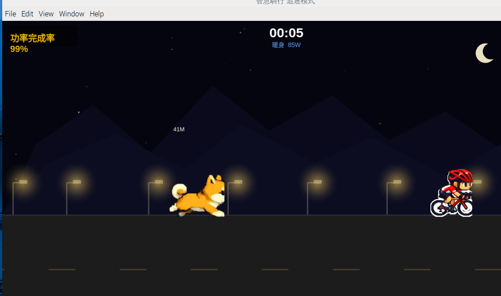

### 模組

| 模組 | 職責 |
|------|------|
| `themes.ts` | 主題、幀、背景旗標 |
| `chase-scene.ts` | 地形、動態路面、主題背景、追逐者 |
| `game-state.ts` | 計畫、距離、狀態機 |
| `hud.ts` | 儀表板（文案隨主題） |

---

## 開發備註

- 素材：`assets/*.png`、`assets/chaser-frames.json`
- 截圖：`docs/screenshots/`
- 規格草稿：`cycling-chase-game-prompt.md`

---

## 授權

私有專案／依專案擁有者約定使用。
