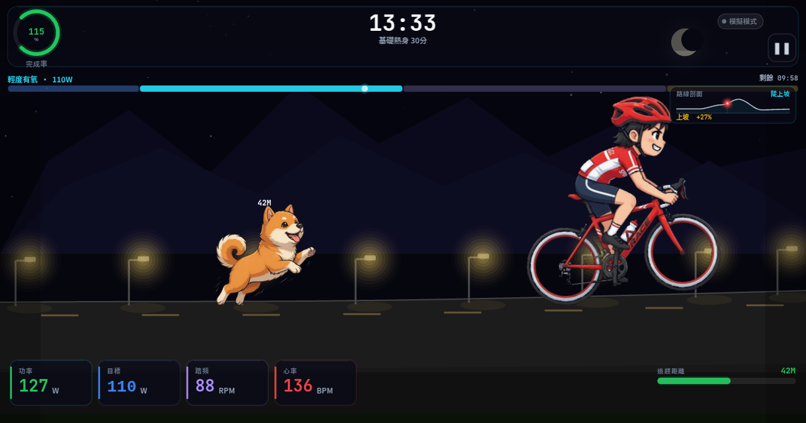

# 智慧騎行 · 追逐模式

以遊戲化方式進行室內騎行功率訓練。維持目標功率，甩開後方柴犬的追趕；功率不足時距離縮短，緊張感隨之升高。訓練路線含**平路／上坡／下坡**起伏，並以右上角**路線剖面簡圖**標示目前位置。

**平台：** Electron 桌面應用（Raspberry Pi 5 ARM64 / Windows x64）  
**版本：** 1.1.0

---

## 遊戲畫面

### 主選單

星空與遠山背景，可直接以模擬模式開始，或先連接 BLE 騎行台。


### 訓練計畫選擇

內建六套分段功率計畫，右側顯示段落細節後即可開騎。


### 追逐場景 · 上坡

夜間道路、路燈、騎士與柴犬對峙；頂部為計時與段落進度，底部為功率／踏頻／心率與追逐距離。右上角**路線剖面**以紅點標示目前進度與坡度階段。



### 追逐場景 · 下坡

同一路線不同進度：剖面圖進入下坡區段，坡度標示即時更新。


### 角色素材

| 騎士（正常／緊張） | 柴犬（奔跑／吠叫） |
|:---:|:---:|
|  |  |

完整 sprite sheet 見 `assets/rider.png`、`assets/dog.png`。

---

## 遊戲玩法

1. 在主選單選擇 **開始訓練**（可選：先以 BLE 連接騎行台）
2. 挑選訓練計畫（熱身、耐力、間歇、節奏、甜蜜點、自由騎乘）
3. 騎行過程中：
   - **功率 ≥ 目標** → 與柴犬拉開距離，進入安全區
   - **功率 < 目標** → 柴犬逼近；過近會觸發緊張表情與危險紅邊
4. 柴犬會間歇休息，再急速追上，節奏更有變化
5. 計畫結束後顯示訓練結算（時間、平均／最大功率等）

### 操作快捷鍵

| 按鍵 | 功能 |
|------|------|
| `Space` / `P` | 暫停／繼續 |
| `Esc` | 暫停；已暫停時返回主選單 |

畫面右上角也可點擊暫停按鈕。

---

## 主要特色

- **功率驅動的追逐機制** — 距離隨功率完成率即時變化（0–80 m）
- **多種訓練計畫** — 內建 6 套分段功率計畫，含自由騎乘
- **BLE 騎行台** — 透過 FTMS（`@abandonware/noble`）讀取功率／踏頻，並可下發目標功率；未連接時自動使用模擬數據
- **商業級介面** — 主選單、計畫選擇、儀表板 HUD、暫停與結算覆蓋層
- **高品質角色動畫** — 騎士（正常／緊張）與柴犬（奔跑／吠叫）多幀插畫 sprite
- **跨平台打包** — electron-builder 支援 Linux ARM64（Pi）與 Windows x64

---

## 技術架構

| 層級 | 技術 |
|------|------|
| 殼層 | Electron 32 |
| 畫面 | PixiJS 8 + TypeScript |
| 建置 | Vite 6（renderer）+ tsc（main） |
| BLE | `@abandonware/noble`（FTMS 0x1826） |
| 打包 | electron-builder |

### 專案結構

```
cycling-chase-game/
├── assets/                 # 角色與粒子素材（rider / dog / sweat）
├── docs/screenshots/       # README 遊戲畫面截圖
├── src/
│   ├── main/               # Electron 主進程 + BLE + IPC
│   │   ├── index.ts
│   │   ├── ble-manager.ts
│   │   ├── ipc-handlers.ts
│   │   └── preload.ts
│   └── renderer/           # 遊戲畫面（PixiJS）
│       ├── index.ts        # 場景切換、啟動
│       ├── game/
│       │   ├── chase-scene.ts
│       │   ├── game-state.ts
│       │   └── hud.ts
│       ├── scenes/
│       │   ├── menu-scene.ts
│       │   └── plan-scene.ts
│       ├── ui/
│       │   ├── theme.ts
│       │   └── components.ts
│       └── utils/
│           └── ble-bridge.ts
├── package.json
├── vite.config.ts
└── electron-builder.yml
```

---

## 環境需求

- **Node.js** 22+（建議）
- **npm** 10+
- BLE 實機測試：具備藍牙的主機（Pi 5 需已安裝系統藍牙堆疊）
- 開發預覽可僅用瀏覽器／Electron（模擬模式，無需騎行台）

---

## 安裝與執行

```bash
# 安裝依賴（會 rebuild native BLE 模組）
npm install

# 開發模式（Vite + Electron）
npm run dev
```

僅預覽 renderer（不開 Electron）時：

```bash
npx vite --host 127.0.0.1 --port 5173
# 瀏覽器開啟 http://127.0.0.1:5173
```

除錯捷徑（開發用）：

- `?screen=plan` — 直接進入計畫選擇
- `?screen=chase` — 直接進入追逐場景

---

## 建置與發行

```bash
# 完整建置（TypeScript + Vite + Electron main）
npm run build

# 打包 Raspberry Pi 5（Linux arm64 AppImage）
npm run dist:pi

# 打包 Windows x64
npm run dist:win
```

產物目錄由 `electron-builder.yml` 設定（預設 `release/`）。

---

## 訓練計畫一覽

| 計畫 | 時長 | 說明 |
|------|------|------|
| 基礎熱身 30分 | 30 min | 暖身 → 輕度有氧 → 節奏 → 緩和 |
| 耐力提升 30分 | 30 min | 有氧穩態為主 |
| 間歇訓練 60分 | 60 min | 多次高強度 220W + 恢復 |
| 節奏騎乘 60分 | 60 min | 節奏區間持續騎 |
| 甜蜜點訓練 60分 | 60 min | Sweet Spot 三段 |
| 自由騎乘 | 不限 | 固定目標 120W，無時限 |

距離與狗狀態邏輯摘要：

- 距離範圍 **0–80 m**；剛好達標（100%）時平衡點約 **40 m**
- 距離向「功率完成率對應的平衡距離」平滑收斂（不足時狗較積極、過剩時拉開需持續出力）
- **≤ 10 m**：危險（畫面震動、紅邊、緊張表情）
- **≤ 25 m**：緊張狀態
- 狗節奏：**追逐 → 退場 → 休息 → 急速追回 → 追逐**（危險貼近時不休息）

---

## BLE 說明

- 協定：FTMS Indoor Bike（Service `0x1826`）
- 主選單可點 **連接騎行台 (BLE)** 掃描並連線
- 連線成功後關閉模擬模式，HUD 顯示裝置名稱
- 斷線後自動回到模擬模式

未安裝藍牙或 noble 建置失敗時，仍可完整使用模擬模式遊玩／展示。

---

## 開發歷程

本專案以「功率訓練 + 追逐遊戲」為核心，從規格草稿走到可在 Pi 5 / Windows 打包的 Electron 應用。重點演進如下。

### 時間軸

| 階段 | 版本 | 重點 |
|------|------|------|
| **0. 概念與規格** | — | 以 Google Antigravity 完整 prompt（`cycling-chase-game-prompt.md`）定義技術棧：Electron 32 + PixiJS 8 + TypeScript、FTMS BLE、六套訓練計畫、距離 0–80 m 與狗的追逐／休息狀態機。目標平台：Raspberry Pi 5（ARM64）與 Windows x64。 |
| **1. 核心玩法原型** | 0.x | 先做出可跑的追逐循環：路面捲動、距離依功率完成率變化、簡易 HUD。角色先以像素風示意，驗證「功率不足 → 狗逼近」的手感。 |
| **2. 場景與殼層** | 0.x | 補齊主選單、計畫選擇、暫停／結算；Electron 主進程、preload、IPC；未連線時自動模擬功率／踏頻。 |
| **3. 商業級 UI** | 1.0 | 抽出 `theme.ts` / `components.ts`，夜間星空遠山統一視覺；HUD 改為完成率環、段落進度條、功率／目標／踏頻／心率儀表。 |
| **4. 角色與特效升級** | 1.0 | 騎士插畫風（正常／緊張各 6 幀），柴犬奔跑 6 幀 + 吠叫 3 幀；緊密裁切 frame rect、汗珠粒子。 |
| **5. BLE 與發行** | 1.0 | `@abandonware/noble` 讀取 FTMS Indoor Bike（`0x1826`）；electron-builder 支援 `dist:pi` / `dist:win`。 |
| **6. 追逐手感重構** | 1.1 | 距離改為「功率平衡點平滑收斂」；狗狀態 `chasing → retreating → resting → returning`；危險貼近時不休息；視覺退場／衝回不再瞬移。 |
| **7. 可變坡度 + 剖面簡圖** | 1.1 | `TERRAIN_PROFILE` 定義平路／緩上／陡上／下坡／收尾；路面動態多邊形；騎士／狗／燈／虛線貼合海拔；右上角路線剖面 + 紅點即時進度。 |

### 早期原型 vs 現況

早期以簡化像素角色驗證機制（約 2026-06）：


現況為插畫角色、商業級 HUD、可變坡度路線與剖面簡圖（見上方「遊戲畫面」）。

### 設計決策摘要

- **為什麼是「柴犬追逐」**：把枯燥的功率區間轉成可見的威脅距離，完成率一目了然，失敗成本低、動機強。
- **模擬模式優先**：BLE 建置／硬體不穩時仍可完整展示與調 UI；連上騎行台後再關閉模擬。
- **Renderer / Main 分離**：Pixi 只負責畫面與狀態呈現；BLE 留在 main，透過 preload 暴露安全 API。
- **距離平衡模型**：達標約 40 m，不足狗較積極、過剩拉開需持續出力，比固定 ±m/s 更順、更好讀。
- **坡度與進度綁定**：海拔隨訓練進度（0~1）變化，自由騎乘則循環剖面，避免固定平路疲勞。
- **Sprite 緊密裁切**：格線內空白不影響畫面比例，幀座標集中在 `chase-scene.ts`。

### 主要模組對照

| 模組 | 職責 |
|------|------|
| `src/renderer/game/game-state.ts` | 計畫定義、距離平衡模型、狗狀態機、訓練 tick |
| `src/renderer/game/chase-scene.ts` | 地形剖面、動態路面、角色動畫、路燈／虛線、危險效果、路線簡圖 |
| `src/renderer/game/hud.ts` | 儀表板、進度、暫停與結算 |
| `src/renderer/scenes/*` | 主選單、計畫選擇 |
| `src/main/ble-manager.ts` | FTMS 掃描、連線、功率／踏頻／控制點 |
| `src/renderer/ui/*` | 設計 token 與共用 UI 元件 |

### 後續可延伸（未實作）

- 坡度連動目標功率或模擬阻力（上坡加難、下坡減載）
- 實機心率帶並顯、歷史成績與曲線
- 更多角色／季節場景、難度曲線微調
- 音效與震動回饋、多語系

---

## 開發備註

- 角色素材位於 `assets/rider.png`、`assets/dog.png`；舊版備份可為 `*.bak`
- 完整規格與早期程式草稿：`cycling-chase-game-prompt.md`
- 畫面截圖：`docs/screenshots/`
- 畫面設計 token 與元件：`src/renderer/ui/`
- 狀態機與計畫定義：`src/renderer/game/game-state.ts`

---

## 授權

私有專案／依專案擁有者約定使用。
